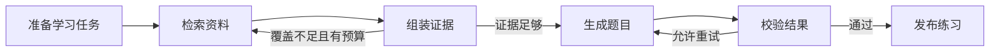

<div align="center">
  
  <h1>知学 AI · Zhixue AI</h1>
  <p><strong>一个面向 Agent 应用开发的开源实战学习项目</strong></p>
  <p>围绕课程学习、知识库问答与智能练习，学习 Agent 编排、RAG 检索和 AI 应用工程。</p>
</div>

<p align="center">
  
  
  
</p>

## 项目介绍

知学 AI 通过一个可以运行的 AI 学习应用，展示如何把大模型、知识库检索、任务编排和前后端开发组合成完整的产品。

你可以按主题或自己的资料创建课程，查看纲要、逐课学习并完成练习；也可以围绕资料进行多轮问答，用学习空间串联目标、练习、错题与复习。通过阅读和修改代码，可以学习一个 Agent 应用如何组织检索、生成、校验、异步任务与费用管理。

项目适合希望实践 **Agent 开发、RAG 应用、AI 后端与全栈开发**的同学，支持在电脑和手机浏览器中使用，也适合作为课程设计、个人项目和二次开发的起点。

## 项目特色

- **课程学习**：支持无资料主题课程和资料课程，先生成纲要，再按需生成课文；每课配三道客观题检查，阅读、首次检查与错题补练分别记录和展示。
- **知识库问答**：上传 PDF、DOCX、Markdown、TXT，选定资料或章节进行多轮追问，点击引用查看原文，还能根据有依据的回答生成练习。
- **智能练习**：覆盖单选、多选、判断、填空、数值、短解释六类题型，支持配置题量和难度、保存作答进度、查看反馈与解析。
- **学习空间**：按主题管理资料、目标、单元与知识点，记录学习过程，结合错题本和复习队列安排后续练习。
- **分层评分**：客观题、填空和数值题采用规则评分；短解释支持模型暂定评分、授权复核和独立自评，保留评分来源与历史。
- **Agent 工作流**：使用 LangGraph 编排检索、生成与校验，根据反馈补检索或有限再生成，并控制调用次数、时间与费用。
- **混合 RAG**：集成 LlamaIndex、Chroma、中文 BM25、RRF 融合、模型重排与父段扩展，支持切换方案进行对比。
- **评测工作台**：管理数据集、标注依据、运行评测，对比质量、耗时与费用，支持可选的模型 Judge。
- **完整 Web 应用**：提供账号体系、资料管理、历史记录、持久任务和 Docker 部署，支持 Claude、DeepSeek 与 OpenAI 兼容服务。

## 你能学到什么

| 方向 | 项目中的实践 |
| --- | --- |
| Agent 编排 | 状态图、条件分支、结果校验、有限重试与停止条件 |
| RAG 与上下文 | 文档分块、混合召回、重排、证据组装与引用追溯 |
| 模型接入 | 聊天模型与 Embedding 分离，适配不同协议与服务商 |
| AI 应用工程 | 异步任务、租约、幂等提交、失败恢复与调用预算 |
| 学习应用设计 | 课程纲要、按需课时、问答转练习、真实学习记录与分层评分 |
| 效果评测 | 固定数据和配置，从质量、耗时、费用三个维度比较方案 |
| 前后端交付 | React + FastAPI、用户鉴权、数据持久化与容器化部署 |

以资料出题为例，核心工作流如下；补检索与再生成都受预算和次数限制：



**技术栈：** Python 3.11、FastAPI、LangGraph、LangChain、LlamaIndex、Chroma、MySQL、React 19、TypeScript、Vite、Docker Compose。

## 快速开始

推荐使用 Docker 启动。请先安装 **Docker Desktop / Docker Engine、Docker Compose 2.24.4+ 和 Python 3.11**，下载源码后在项目根目录执行。

**1. 生成配置**

```shell
python deploy/init_env.py
```

脚本会创建 `deploy/.env` 并生成数据库密码与应用密钥。要使用真实课程生成、问答、出题和资料检索，按下方说明填写 LLM 与 Embedding 配置；暂不配置模型时，也可以启动网页体验注册、登录和预置题目。

**2. 构建并启动**

```shell
docker compose --env-file deploy/.env -f deploy/compose.yaml -f deploy/compose.local.yaml build
docker compose --env-file deploy/.env -f deploy/compose.yaml -f deploy/compose.local.yaml up -d --wait mysql
docker compose --env-file deploy/.env -f deploy/compose.yaml -f deploy/compose.local.yaml run --rm migrate
docker compose --env-file deploy/.env -f deploy/compose.yaml -f deploy/compose.local.yaml up -d api rag-owner eval-scorer web
```

**3. 打开网页**

访问 **[http://localhost:18080](http://localhost:18080)**，注册账号后即可开始使用。

在「我的课程」点击「开始新课程」，输入主题、学习目标和已有基础，设置每天时长与课时数。默认 6 节课、每天 20 分钟，可分别调整为 1–10 节和 5–120 分钟；每天时长用于约束单课的预计用时。

| 课程模式 | 使用方式 |
| --- | --- |
| 主题课程 | 无需上传资料，使用当前 LLM 生成课程，并标明未经外部资料核验 |
| 资料课程 | 先上传并完成资料处理，再选择资料或章节；按冻结的资料版本生成内容并提供引用 |

课程学习流程：**生成纲要 → 按需生成课时 → 阅读与自检 → 三题练习 → 查看首次检查与补练学情**。

开始生成课时前可以调整课程和课时标题。已生成课文会保存，继续学习时直接读取；阅读完成由你标记。课后检查使用单选、多选、判断题，作答后查看规则判分和解析，有错题时可回看本课并发起补练。首次检查成绩和各次补练单独展示，下一步根据未完成练习、错题和阅读记录推荐。

资料课程可点击引用查看原文，保留资料、章节及来源版本。材料不足的课时会标明缺口；资料删除或授权失效后，相关内容停止展示。主题课程不调用资料检索，两种课程模式均不自动联网。

也可以使用资料问答和学习空间：

**上传资料 → 创建学习空间与目标 → 提问或生成练习 → 作答与查看反馈 → 错题整理与复习**

在「学习空间」中选定资料范围、添加目标和知识点，即可生成综合练习；也可以从知识库回答发起练习，将问答与后续学习记录关联起来。短解释的模型评分在未配置有效校准方案时显示为暂定分，自评单独保存。

网页单份资料限制为 10 MB；PDF 需要包含可提取的文字，扫描件应先进行 OCR。注册时请保存一次性恢复码，以便找回账号。

## 模型与服务配置

Docker 部署统一编辑 `deploy/.env`。完整配置项见 [环境变量模板](deploy/env.example)。

### 基础配置：LLM + Embedding

LLM 负责课程生成、问答、出题和报告；Embedding 负责资料向量化。主题课程使用当前 LLM 配置，资料课程和知识库功能还需要配置 Embedding。

以下以 Claude 和 DashScope Embedding 为例：

```dotenv
LLM_PROVIDER=anthropic
ANTHROPIC_API_KEY=your_anthropic_api_key
ANTHROPIC_BASE_URL=https://api.anthropic.com
ANTHROPIC_MODEL=claude-sonnet-4-6

DASHSCOPE_API_KEY=your_embedding_api_key
DASHSCOPE_BASE_URL=https://dashscope.aliyuncs.com/compatible-mode/v1
DASHSCOPE_EMBEDDING_MODEL=text-embedding-v4
EMBEDDING_DIMENSIONS=1024
```

请使用服务商实际开放的模型名称。向量模型与维度必须匹配；更换 Embedding 模型后需要重建索引。Claude 地址使用 API 根地址，不填写完整的 `/messages` 路径。

也可以切换聊天模型：

| 服务 | 配置方式 |
| --- | --- |
| DeepSeek | `LLM_PROVIDER=deepseek`，填写 `DEEPSEEK_API_KEY`、`DEEPSEEK_BASE_URL`、`DEEPSEEK_MODEL` |
| OpenAI 兼容服务 | `LLM_PROVIDER=openai_compatible`，填写 `LLM_API_KEY`、`LLM_BASE_URL`、`LLM_MODEL` |

MySQL 和基础评分进程由 Compose 启动，Chroma 随 RAG owner 运行，无需额外部署 Redis 或本地 GPU。资料及索引保存在本地数据卷中，检索片段会发送给你配置的模型服务。

环境模板已启用综合练习：`PRACTICE_ENABLED=true`、`PRACTICE_SHORT_ANSWER_ENABLED=true`。短解释生成和评分使用当前 LLM；仅需规则题型时，可将第二项设为 `false`。

### 课程生成配置

环境模板已启用课程生成，使用与问答、练习相同的 LLM 配置：

```dotenv
COURSE_ENABLED=true
COURSE_PROVIDER_TIMEOUT_SECONDS=120
COURSE_JOB_DEADLINE_SECONDS=300
```

`COURSE_ENABLED` 控制课程生成入口；后两项分别限制单次课程模型请求和课程任务的执行时长，默认是 120 秒和 300 秒。课程按次生成纲要或一节正文，沿用现有计费与每日预算；读取已保存课文不产生模型调用。

### 可选能力

| 能力 | 配置方式 |
| --- | --- |
| 混合检索 | 设置 `RAG_PIPELINE_ID=hybrid-v1`；默认 `dense-v1` 使用向量检索 |
| 复用 Claude 等聊天模型重排 | 设置 `RAG_PIPELINE_ID=hybrid-llm-rerank-v1`，直接使用当前 LLM 配置 |
| 专用重排服务 | 设置 `RAG_PIPELINE_ID=hybrid-rerank-v1`，填写模板中的 `RERANKER_*` 服务配置 |
| 联网补充 | 配置 `ENABLE_WEB_SEARCH=true` 与 `TAVILY_API_KEY`，并由用户在页面开启 |
| 题目配图 | 配置 `DASHSCOPE_IMAGE_*`，创建练习时开启配图 |
| 外部评测 Judge | 配置独立 Judge 模型，并启用 `compose.judge.yaml`，操作见下方折叠说明 |

费用设置见模板中的 `PRICING_VERSION`、各项单价及每日预算。token 单价以人民币 / 百万 token 为单位，需按实际服务价格填写；未知价格保持未设置，避免按零费用记录。

修改配置后，重新创建相关服务：

```shell
docker compose --env-file deploy/.env -f deploy/compose.yaml -f deploy/compose.local.yaml up -d --force-recreate api rag-owner eval-scorer
```

真实密钥保存在自己的 `.env` 中，不要提交到仓库，也不要写入会打包到浏览器的 `VITE_*` 变量。

## 使用评测工作台

评测流程为：**准备资料 → 创建并标注数据集 → 冻结版本 → 选择方案运行 → 查看与比较结果**。

工作台需要 `evaluator` 角色。注册账号后，管理员可执行以下命令授权；将 `123` 替换为实际用户 ID，完成后重新登录：

```shell
docker compose --env-file deploy/.env -f deploy/compose.yaml -f deploy/compose.local.yaml exec api python scripts/admin.py --user-id 123 --role evaluator
```

用户 ID 可在登录后访问 `/api/v1/auth/session`，查看 `data.user.id`。基础评测无需配置额外 Judge；外部 Judge 用于增加模型判断维度。

<details>
<summary>开启外部 Judge（可选）</summary>

1. 将 [Judge 配置模板](evaluation/judge-config.example.json) 复制为 `deploy/judge-config.json`。
2. 把示例中的模型、地址、价格和预算替换为自己的配置，将 `enabled` 设为 `true`。没有相应人工校准记录时，保持 `calibrated=false`。
3. 在 `deploy/.env` 中添加：

```dotenv
EVAL_JUDGE_CONFIG_FILE=./judge-config.json
EVAL_JUDGE_API_KEY=your_judge_api_key
```

4. 启用独立的 Ragas 评分镜像：

```shell
docker compose --env-file deploy/.env -f deploy/compose.yaml -f deploy/compose.local.yaml -f deploy/compose.judge.yaml up -d --build api eval-scorer
```

后续操作这套部署时继续使用相同的 Compose 文件组合。Judge 可以使用与生成相同的模型，但通过独立配置和密钥变量启用。

</details>

## 常见问题

**上传后一直无法使用资料？**  
确认文件含有可提取文字，Embedding 密钥、模型和维度配置正确。查看资料处理状态及 `rag-owner` 日志。

**配置修改后没有生效？**  
Compose 需要重新创建容器；仅执行 `restart` 不会重新加载环境变量。已有 `deploy/.env` 直接编辑即可，无需重新生成数据库密码和应用密钥。

**如何查看运行问题？**

```shell
docker compose --env-file deploy/.env -f deploy/compose.yaml -f deploy/compose.local.yaml ps
docker compose --env-file deploy/.env -f deploy/compose.yaml -f deploy/compose.local.yaml logs --tail 100 api rag-owner eval-scorer
```

**可以部署到服务器吗？**  
可以。使用 `deploy/compose.yaml`，设置实际 HTTPS `WEB_ORIGINS`，将 `fullchain.pem` 与 `privkey.pem` 放入 `deploy/certs/` 并允许 nginx 用户读取。按快速开始中的顺序启动，去掉本地 HTTP 覆盖文件 `compose.local.yaml`。默认使用 80 / 443 端口。

## 参与贡献

欢迎通过 Issue 反馈问题、分享使用经验，或提交 Pull Request 改进功能与文档。反馈运行问题时，请附上复现步骤、环境版本和已脱敏的错误信息。

## 开源协议

本项目使用 [MIT License](LICENSE)，欢迎学习、使用与二次开发。
