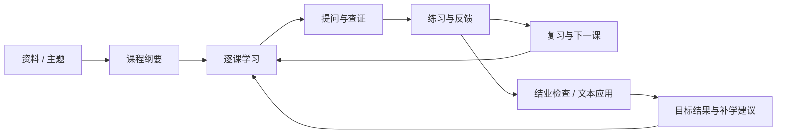
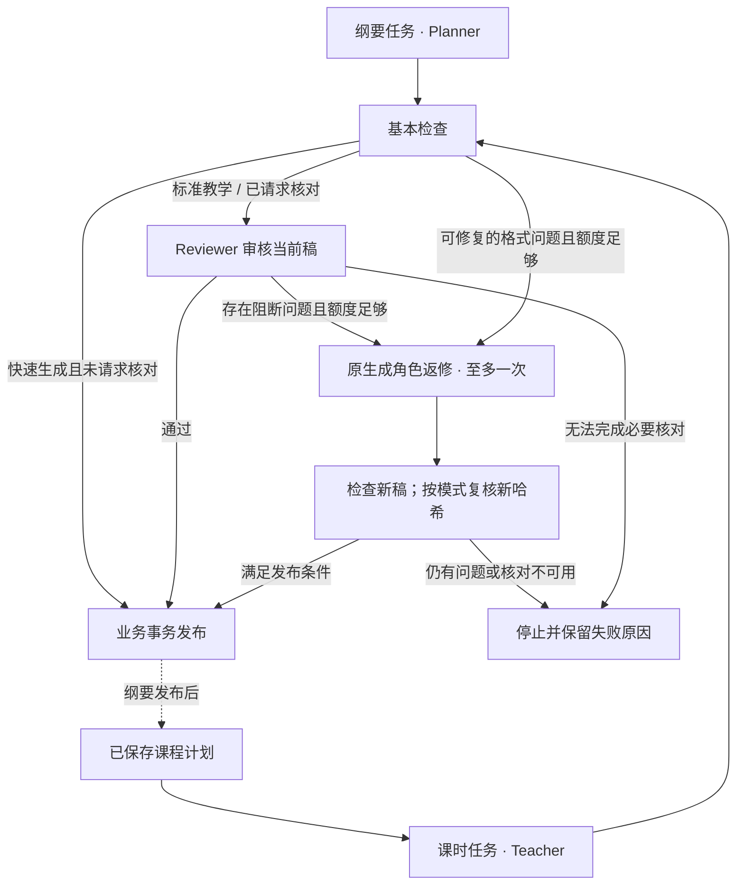
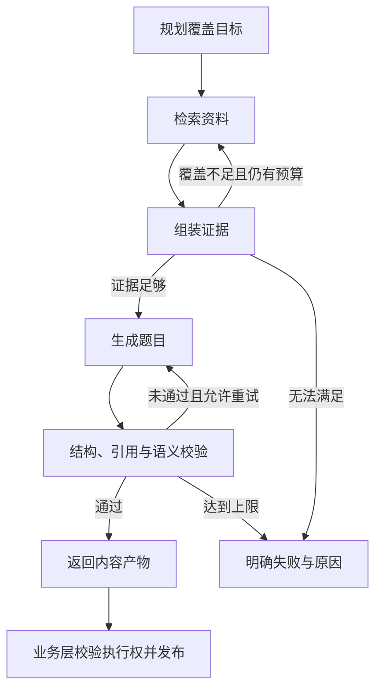
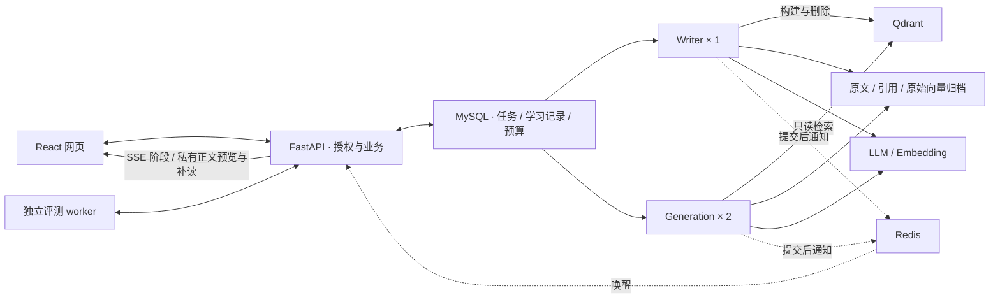

<div align="center">
  
  <h1>循课 AI · Xunke AI</h1>
  <p><strong>把资料组织成课程，让学习有依据、有反馈、有下一步。</strong></p>
  <p>以课程为核心的开源学习 Agent，也是一个可以运行、拆解与扩展的 Agent 应用开发项目。</p>
  <p>
    <a href="#quick-start">快速开始</a> ·
    <a href="#agent-design">Agent 设计</a> ·
    <a href="#architecture">系统架构</a> ·
    <a href="#configuration">配置指南</a>
  </p>
</div>

<p align="center">
  
  
  
  
  
</p>

## 循课 AI 是什么

循课 AI 面向“手里有资料，却不知道如何系统学习”的个人自学场景。输入一个主题，或上传自己的资料，就能创建课程、逐课学习、围绕内容提问，再通过练习、结业检查与复习记录继续推进。

对于开发者，循课 AI 提供一套完整的 Web 实践：**用 LangGraph 组织有边界的教学多 Agent 与 RAG 工作流，用 LlamaIndex 接入可追溯检索，将教学 Skill、正文流、学习证据和模型预算连接起来。** 适合学习 Agent / RAG 应用开发、课程设计和二次开发，支持电脑与手机浏览器。



## 可以做什么

| 能力 | 使用方式 |
| --- | --- |
| **生成自己的课程** | 输入主题即可开始，目标、基础与学习安排按需补充；默认准备第一课。教学协作就绪后可选择标准教学，由 Planner、Teacher、Reviewer 分工规划、讲解和核对，也可选择快速生成。 |
| **边学边问** | 对当前课文自由提问，解释某一段、换个例子或获取提示；保存自检回答，再按需请求反馈。 |
| **尽早看到可读内容** | 开启正文流后，课文和知识库回答可按经过基本检查的完整块提前展示；部分课内助教回答增量显示。页面区分生成中预览与正式发布内容。 |
| **基于资料查证** | 上传 PDF、DOCX、Markdown、TXT，限定资料或章节多轮问答，点击引用回到原文，还可从有依据的回答发起练习。 |
| **练习与反馈** | 产品覆盖单选、多选、判断、填空、数值、短解释六类题型；课程每课配三道客观题检查，支持继续作答与查看解析。 |
| **对照目标检验学习结果** | 课程结业检查提供客观题与文本应用任务，回答先保存、反馈可恢复；逐项目标展示待验证、需补学、已验证或旧版本证据，并说明判断依据。 |
| **持续学习** | 学习空间管理目标、资料与知识点，记录首次检查、补练、错题和复习；“今日学习”结合未完成活动与到期任务推荐下一步。生成完成或失败时，无论当前在哪个页面都会收到提醒。 |
| **比较 RAG 方案** | 在评测工作台冻结数据和配置，比较召回、排序、引用、耗时与费用，按需启用模型 Judge。 |

<a id="design"></a>
<a id="agent-design"></a>

## Agent 设计：编排、工具、上下文与执行边界

循课 AI 将 Agent 应用拆成可单独理解和替换的职责。模型输出先成为内容产物，通过校验后才进入业务系统；工具执行、资料访问和状态更新都有程序约束。

| 关注点 | 当前设计 | 解决的问题 |
| --- | --- | --- |
| **LangGraph · 双工作流** | 保留 RAG 出题图；教学图组织 Planner / Teacher / Reviewer，结构修复与内容返修共享一次机会 | 让协作有实际产物、条件分支、预算和停止原因 |
| **LangChain · 模型协议** | 使用 ChatAnthropic / ChatOpenAI 适配原生 Claude 与兼容接口，统一调用包装 | 业务逻辑复用同一调用入口，便于更换服务商 |
| **LlamaIndex · 知识检索** | 管理节点与文档存储；通过自有投影接口连接 Chroma / Qdrant，再与 BM25 / RRF 配合 | 向量后端可替换，证据与权限契约保持一致 |
| **Tool Interfaces · 工具边界** | 显式注入检索、生成、语义校验和重新授权等接口，限定各任务可用能力 | 工具便于替换与隔离验证，模型不能任意写库或结算成绩 |
| **Context & Memory · 上下文与记忆** | 会话持久化，按来源范围与预算选择历史；每轮事实重新检索，课程只加载相关教学规则 | 连续对话保留意图，历史回答不冒充新一轮事实依据 |
| **Structured Output · Teach v2** | 课程目标关联讲解块、示例与自检；草稿、审核报告、学习证据分别绑定版本与身份 | 校验目标是否被教到、检查是否匹配，教学审核不替代学生成绩 |
| **Redis · 交互加速** | Lua 共享突发限流、Pub/Sub 唤醒 SSE、可选查询向量缓存；阶段流与私有正文流分别授权 | 内容可提前阅读，断线可补读，缓存命中不重复调用模型 |
| **Qdrant · 共享检索** | 原生异步 SDK，单写者和两个只读生成 worker，完整身份过滤后再 Top-K | 长生成任务可以并行，索引发布与资料权限仍由 MySQL 决定 |

### 教学多 Agent：一份计划，按课执行，有界复核

一次学习从一份轻量纲要开始。默认在纲要生成后准备第一课，其余课时进入后按需生成，已生成课文保存复用；取消自动准备后可先调整标题，首次生成课时后固定纲要，保持目标与内容一致。

教学规则作为版本化的 [Teach Skill](.agents/skills/xunke-teach/SKILL.md) 加载，使用 LangGraph 明确组织三个角色：

| 角色 | 实际职责 | 交付给下一步的内容 |
| --- | --- | --- |
| **Planner** | 根据学习目标、基础和资料范围规划课程 | 可观察的课程目标、课时顺序和前置关系，发布后跨课时复用 |
| **Teacher** | 沿用已保存计划，生成当前课时 | 与目标对应的讲解、示例、自检和来源引用 |
| **Reviewer** | 独立核对当前稿的目标、先修、示例、检查、来源与答案泄露 | 结构化问题与修改建议，绑定当前草稿、计划和规则版本 |



标准教学（`guided`）对纲要和课文执行教学核对；快速生成（`fast`）默认只做基本检查。**格式修复和内容返修共用一次机会，返修后重新检查新稿，旧报告不能替新内容背书。** 审核超时、调用预算不足或复核仍有问题时，所请求的审核稿不会发布为合格内容。

角色可以使用同一个已配置模型，但各自拥有固定职责、上下文、工具白名单和调用目的。应用记录真实角色阶段与调用账本；增加 generation worker 数量只是并行执行任务，与这套教学协作分开。默认配置保留快速生成，开启教学 Agent 并确认 worker 就绪后，网页才提供标准教学。

### Teach v2：目标、讲解、示例和检查相互对应

每个课程目标都有明确的预期行为。课时通过局部目标引用说明“这一课教什么”，正文、示例与自检继续绑定这些目标；应用检查目标覆盖、引用有效性和前置顺序，再为发布后的目标分配稳定身份。旧版课程仍可读取和继续学习。

**课程内容的审核结果与用户的学习结果分别保存。** Reviewer 通过说明该稿完成了所请求的教学核对；只有符合目标类型、版本和确认条件的学习证据，才能支持目标状态变化。模型审核不能证明学习者已经掌握，也不能代替真实样本的质量评估。

### LlamaIndex + 混合 RAG：同一份证据贯穿检索与使用

资料课程、知识库问答和资料练习复用证据结构，保留文档版本、章节与原文定位。检索时先限定用户和来源范围，再取候选；引用在生成后核验，展示时继续检查资料授权。

向量与中文 BM25 分别提供语义和关键词召回，RRF 按排名融合，可选重排与父段扩展补充上下文。**检索方案可以替换，内容依据仍然可追溯。** 主题课程明确使用模型知识，资料不足则标明缺口。

LlamaIndex 承担节点与文档存储适配；向量投影可选择轻量 Chroma 或服务化 Qdrant。Qdrant 使用原生异步 SDK，通过项目自己的 Evidence 契约连接来源、上下文和引用。会话历史用于理解追问，当前授权资料提供事实依据，两者分别进入上下文管理。

### 保留 RAG LangGraph：每一次回路都有触发条件和终点

资料出题采用 LangGraph 编排。证据覆盖不足时补检索，生成结果未通过校验时有限再生成；轮次、模型调用数、时间和费用共同约束执行。



图中展示严格资料出题链路；预算耗尽、超时或授权失效也会停止执行。**原有 RAG 图继续承担检索与出题，新增教学图承担课程角色协作。** 两张图保留各自的状态和条件边，共用受控执行摘要；图负责内容产物，业务层负责发布与结算。问答与综合练习继续使用各自的业务流程。

状态包含覆盖计划、候选证据、检索轮次、生成次数和校验结果；条件边读取这些状态决定下一步。当前资料出题最多两轮检索、两次生成，且受共同调用预算约束。持久恢复由外层任务与 attempt 管理，当前未配置 LangGraph Checkpointer 做逐节点续跑。

### 正文流：同一次调用，提前阅读，最终原子发布

开启 `CONTENT_EVENTS_ENABLED` 后，同一条模型流一边聚合完整产物，一边提供允许预览的内容。课文只输出结构完整、目标与来源引用通过基本检查的块；知识库回答按引用有效的块输出；主题课内的解释、举例和提示支持文本增量。提示词、工具参数、隐藏推理与私有评分依据不进入预览。

正文流与任务阶段流使用独立协议。重连按任务、执行轮次、草稿版本和游标补读；进入返修会清除旧稿预览，取消或来源失效会停止读取。**预览不写成正式课文，正文显示完也不等于发布成功。** 完整产物通过检查并提交后，页面重新读取正式结果。

一次流式生成只预占和结算一次调用，不会为取得最终 JSON 再调用模型。不支持流式的服务保留完整响应；流中断后不会自动追加一次付费请求。Redis 可加速唤醒，正文帧仍由 MySQL 短期保存，关闭正文流也能照常生成和读取结果。

### 持久任务与预算：长任务可恢复，重复操作有边界

课程、问答和出题进入 MySQL 持久任务队列。worker 用租约与心跳维护执行权，发布前再次校验，避免旧执行结果覆盖新结果；幂等键处理重复提交，成绩结算保留收据。

同一套外呼计量记录模型用量，调用前预占预算、结束后结算。超时且费用未知的调用保留预占，等待对账。**任务状态、业务结果与模型费用各自有据可查。**

教学任务还保存阶段占位、冻结策略和草稿身份。新租约可以继续已经确认的阶段结果，但不能重置返修次数或总调用额度；上一外呼结果不明时停止自动恢复，由用户明确重试。最终发布再次检查当前租约、课程计划、来源和草稿绑定。

<details>
<summary>为什么当前使用 MySQL 任务队列，Redis 在这里适合做什么？</summary>

当前采用 MySQL 的行锁与 `SKIP LOCKED` 领取任务，将任务发布、学习记录和预算状态放在已有的事务体系内协调，减少需要共同维护的基础设施。数据库保存事实，租约与幂等控制有效结果；这项选择优先服务于当前部署规模和一致性需求。

Redis 承担共享突发限流和任务阶段推送：状态变更与公开事件同事务写入 MySQL，提交后才发唤醒通知。前端通过 SSE 接收阶段，并按游标补读；Redis 故障时继续使用 SQL 硬限制和状态查询。课程、助教、问答、出题与练习使用同一套事件协议。

查询 Embedding 可使用独立 Redis 缓存，按用户、来源空间、模型版本和原始查询隔离。命中时直接复用向量，不再次调用或计费；评测、文档入库和未固定模型版本的查询绕过缓存。成绩、费用、验证码消费与发信配额继续由 MySQL 事务管理。

</details>

### 索引可替换，历史依据可保留

Qdrant 的物理写入完成后，独立读客户端完整核验向量，业务事务再决定是否发布。查询先限定用户、文档版本、构建和节点范围，再执行 Top-K；生成容器只持有读 key。

迁移直接复制已有向量，保留逻辑文档与引用标识。由于 Qdrant 的 Cosine 存储会归一化向量，系统额外归档原始 float32 向量，新增资料也可据此恢复到 Chroma。删除按登记清理各后端副本；未确认的远端操作保留待恢复记录。

### 教学反馈与学习事实分别记录

自检回答可以直接保存，模型反馈按需请求；页面分别显示保存、反馈生成和结果读取状态，网络恢复后可以取回已保存内容。正式题目按题型评分，首次成绩、补练和复习记录分别保存。

结业检查把课程目标与实际题目关联起来，包含客观题和文本应用任务。客观题沿用现有判分与结算；文本应用先保存不可变回答，再生成教学反馈，当前模型反馈保留 **`provisional`（暂定、未正式确认）**。回答或反馈生成成功都不会自动变成目标已验证。

目标结果由程序依据学习记录计算，展示“待验证 / 需补学 / 已验证 / 旧版本证据”和对应原因。识别题通过只支持相应的识别目标，不能证明已经会解释或应用；帮助使用情况未知时也不会直接推断独立完成。旧课程缺少可信目标映射时保持待验证，不事后伪造关联。

“今日学习”根据未完成练习、到期复习和课程进度计算建议，查看建议无需调用模型。**该用规则判断的地方使用规则，模型集中处理讲解与生成。**

### 用同一把尺子比较改动

评测冻结资料、标注和运行配置，再比较检索或生成方案。确定性检查、可选模型 Judge 和人工复核各有职责；耗时与费用和质量一起记录，帮助判断一次优化是否值得保留。

独立评分进程通过受控 API 获取任务与提交结果，部署时不持有业务数据库凭据或原始资料卷。基础评测可直接运行，外部 Judge 按需启用。

<a id="architecture"></a>

## 系统架构



上图为 Qdrant 模式；轻量部署使用单个 RAG owner 与本地 Chroma。两种模式共用业务、证据和任务协议。

| 层次 | 技术与职责 |
| --- | --- |
| 交互 | React 19、TypeScript、Vite、TanStack Query：课程、问答、练习与任务状态 |
| 业务 | FastAPI、Pydantic、MySQL：身份、权限、数据契约、学习记录、任务与预算 |
| Agent 与模型 | RAG 与教学两张 LangGraph、Planner / Teacher / Reviewer、Teach v2 结构契约；LangChain 适配模型协议 |
| 检索与上下文 | LlamaIndex、Chroma / Qdrant、中文 BM25 / RRF、可选重排、证据契约与上下文预算 |
| 任务与加速 | MySQL 租约队列、Redis Lua / Pub/Sub、SSE 游标恢复、可选查询向量缓存 |
| 运行与评测 | 单 owner 或 writer / generation 分工，独立评测 worker，Docker Compose / Nginx |

LLM、Embedding 与可选重排服务分别配置。Claude 使用原生 Anthropic 协议，也支持 DeepSeek 和 OpenAI 兼容服务。基础部署使用 Chroma；Redis 与 Qdrant 通过独立 Compose 配置启用，无需本地 GPU。已有资料切换向量后端时，请按 [迁移与回退说明](#vector-deployment) 操作。

<a id="quick-start"></a>

## 快速开始

准备 **Docker Desktop / Docker Engine、Docker Compose 2.24.4+ 和 Python 3.11**，下载源码后在项目根目录执行。

**1. 生成私有配置**

```shell
python deploy/init_env.py
```

脚本创建 `deploy/.env` 并生成独立随机密钥。已有该文件时直接编辑，保留现有数据库与应用密钥。

**2. 配置模型与注册邮箱**

编辑 `deploy/.env`，先完成下面三类配置：

| 服务 | 作用 | 配置入口 |
| --- | --- | --- |
| **LLM** | 课程、答疑、练习与讲解 | 选择 `LLM_PROVIDER`，填写对应 API 地址、密钥和模型名 |
| **Embedding** | 资料向量化与检索；主题课程无需此项 | `DASHSCOPE_API_KEY`、模型、地址与匹配的向量维度 |
| **SMTP** | 新账号邮箱验证码注册 | QQ / 163 SMTP 地址、发件邮箱与客户端授权码 |

配置示例见下方 [模型与服务配置](#configuration)，所有参数见 [环境变量模板](deploy/env.example)。课程与综合练习在模板中已启用；未配置模型时可以浏览首页和预置题目，已有账号仍可登录，新注册需要 SMTP。

**3. 构建、迁移并启动**

```shell
docker compose --env-file deploy/.env -f deploy/compose.yaml -f deploy/compose.local.yaml build
docker compose --env-file deploy/.env -f deploy/compose.yaml -f deploy/compose.local.yaml up -d --wait mysql
docker compose --env-file deploy/.env -f deploy/compose.yaml -f deploy/compose.local.yaml run --rm migrate
docker compose --env-file deploy/.env -f deploy/compose.yaml -f deploy/compose.local.yaml up -d api rag-owner eval-scorer web
```

打开 **[http://localhost:18080](http://localhost:18080)**，通过邮箱注册并保存恢复码，即可创建课程。恢复码只展示一次；万一没有保存，还可以在登录页使用「邮箱验证码找回密码」。

<a id="configuration"></a>

## 配置与部署

Docker 部署统一读取私有的 `deploy/.env`。初始化脚本生成数据库、应用、验证码、Redis 与 Qdrant 的独立密钥；已有部署定向补充缺少的配置，保留原密钥、Compose 项目名与数据卷。配置修改后，用原 Compose 文件组合执行 `up -d` 重新创建相关容器。

<details>
<summary>模型、Embedding 与注册邮箱</summary>

选择一个 `LLM_PROVIDER`，填写对应服务的地址、密钥和模型名。模型名以供应商实际支持的名称为准，外部评测 Judge 独立配置。

| `LLM_PROVIDER` | 配置项 | 地址示例 |
| --- | --- | --- |
| `anthropic` | `ANTHROPIC_API_KEY`、`ANTHROPIC_BASE_URL`、`ANTHROPIC_MODEL` | `https://api.anthropic.com`，使用原生 Anthropic 协议 |
| `deepseek` | `DEEPSEEK_API_KEY`、`DEEPSEEK_BASE_URL`、`DEEPSEEK_MODEL` | `https://api.deepseek.com` |
| `openai_compatible` | `LLM_API_KEY`、`LLM_BASE_URL`、`LLM_MODEL` | 供应商提供的兼容 API 根地址，通常以 `/v1` 结尾 |

资料检索另需配置 Embedding。变量沿用 `DASHSCOPE_*` 命名，也可填写兼容服务：

```dotenv
DASHSCOPE_API_KEY=your_embedding_api_key
DASHSCOPE_BASE_URL=https://dashscope.aliyuncs.com/compatible-mode/v1
DASHSCOPE_EMBEDDING_MODEL=text-embedding-v4
EMBEDDING_DIMENSIONS=1024
```

`EMBEDDING_DIMENSIONS` 必须匹配模型实际输出。更换模型、维度或分块方案后重建对应资料索引；已有索引不会随环境变量自动转换。`RAG_PIPELINE_ID=dense-v1` 是默认向量基线，`hybrid-v1` 启用 BM25 / RRF，重排配置见 [环境变量模板](deploy/env.example)。

在发件邮箱开启 SMTP 并获取客户端授权码，以 QQ 邮箱为例：

```dotenv
EMAIL_REGISTRATION_ENABLED=true
SMTP_HOST=smtp.qq.com
SMTP_PORT=465
SMTP_SECURITY=ssl
SMTP_USERNAME=your_account@qq.com
SMTP_PASSWORD=your_smtp_authorization_code
SMTP_FROM_EMAIL=your_account@qq.com
SMTP_FROM_NAME=循课 AI
```

163 邮箱使用 `smtp.163.com`，用户名与发件地址填写同一个邮箱。`SMTP_PASSWORD` 使用客户端授权码。SMTP 用于注册和邮箱验证码找回密码；关闭注册后，已有账号仍可登录。真实密钥仅保存在私有配置中。

</details>

<a id="timeouts"></a>

<details>
<summary>功能开关、超时与费用预算</summary>

新环境默认启用 `COURSE_ENABLED`、`PRACTICE_ENABLED` 和 `PRACTICE_SHORT_ANSWER_ENABLED`。课程与课内助教使用 `COURSE_PROVIDER_TIMEOUT_SECONDS` / `COURSE_JOB_DEADLINE_SECONDS`，通用任务使用 `PROVIDER_TIMEOUT_SECONDS` / `JOB_DEADLINE_SECONDS`，分别限制单次外呼与整项任务。

教学协作与正文预览是独立开关，模板中均为关闭。需要使用时，在私有 `deploy/.env` 中显式开启并重新创建 API 与生成 worker：

```dotenv
ENABLE_COURSE_TEACHING_AGENTS=true
CONTENT_EVENTS_ENABLED=true
COURSE_TEACHING_REVIEW_TIMEOUT_SECONDS=60
COURSE_TEACHING_REPAIR_TIMEOUT_SECONDS=90
COURSE_TEACHING_PUBLICATION_RESERVE_SECONDS=5
```

教学角色复用当前 LLM 配置，无需额外购买或配置三个模型；网页根据开关、配置和近期 worker 心跳判断标准教学是否就绪，这不等于已经确认外部模型可调用。已有课程和旧请求不会被自动重跑。

Reviewer 单次审核默认 60 秒，允许配置 1–120 秒；可按供应商延迟调整，例如设为 90 秒。配置只在新任务创建时冻结，旧任务继续使用原策略。审核仍需预留发布时间，整项任务仍受 `COURSE_JOB_DEADLINE_SECONDS` 限制；超时且调用结果未知时不会自动重新发起模型请求。

标准教学中，每个纲要任务最多 4 次 LLM 调用，每个课时任务最多 5 次（计入可能使用的 LLM 重排）；快速生成对应为 2 / 3 次。每个任务至多一次返修、两次 Reviewer 调用，实际正常生成通常少于上限。返修前同时预留复核与发布时间，不能通过延长超时绕过次数和费用预算。

正文流无需启用教学审核，也不强制依赖 Redis；它只改变内容可见时间，完整检查与发布条件保持一致。生产反向代理需保持 SSE 不缓冲，仓库 Nginx 配置已包含相应设置。

按实际供应商价格填写 `LLM_INPUT_CNY_PER_MILLION`、`LLM_OUTPUT_CNY_PER_MILLION`、`EMBEDDING_CNY_PER_MILLION` 等人民币单价，并更新 `PRICING_VERSION`。用户、全局和评测预算见模板；未知价格保持未设置，模型调用次数限制继续生效。涉及付费服务的评测需要价格配置才能执行费用上限控制。

</details>

<a id="redis-deployment"></a>

<details>
<summary>可选 Redis：共享限流、任务阶段推送与查询缓存</summary>

在 `deploy/.env` 中保留初始化生成的 `REDIS_PASSWORD`，开启以下配置，再增加 Redis 覆盖文件：

```dotenv
REDIS_ENABLED=true
REDIS_RATE_LIMIT_ENABLED=true
TASK_EVENTS_ENABLED=true
```

```shell
docker compose --env-file deploy/.env -f deploy/compose.yaml -f deploy/compose.local.yaml -f deploy/compose.redis.yaml up -d
```

Redis 仅在 Compose 内网提供服务。SQL 硬限额与任务事件持续保存；Redis 不可用时，突发限流跳过附加门槛，事件通过 SQL 补读，页面保留状态查询回退。

查询向量缓存使用独立实例及 `REDIS_CACHE_PASSWORD`。设置 `QUERY_EMBEDDING_CACHE_ENABLED=true` 和供应商可确认的 `EMBEDDING_MODEL_REVISION`，然后在上述命令的 `up -d` 前追加 `-f deploy/compose.cache.yaml`。无法确认固定模型版本时留空，系统自动绕过缓存；评测与文档向量化始终绕过查询缓存。使用 Qdrant 时，把它的覆盖文件放在 Redis / cache 之后。

</details>

<a id="vector-deployment"></a>

<details>
<summary>Qdrant：启用并行生成、迁移已有资料与回退 Chroma</summary>

基础部署使用 Chroma 和单个 RAG owner。Qdrant 模式使用单个 writer 和默认两个 generation：writer 处理索引与原有写任务，generation 处理资料问答、课程纲要、课文和课内助教。只读 key 由服务端强制限制；API 与评分进程不持有向量库 key。

已有资料需先复制并核验，再启动 Qdrant 模式。准备维护窗口，等待任务结束，备份 MySQL 与资料卷，保留 Chroma 卷和原镜像。在私有配置中补齐以下值，读写 key 使用初始化脚本生成的不同随机值：

```dotenv
VECTOR_BACKEND=qdrant
VECTOR_TARGET_REVISION=qdrant-v1
VECTOR_PROJECTION_REGISTRY_REQUIRED=true
QDRANT_URL=http://qdrant:6333
QDRANT_COLLECTION_PREFIX=xunke_dense
QDRANT_API_KEY=your_independent_writer_key
QDRANT_READ_ONLY_API_KEY=your_independent_reader_key
QDRANT_GENERATION_WORKERS=2
```

下面的 PowerShell 示例同时启用 Redis；仅使用 Qdrant 时可去掉 Redis 覆盖文件，并保持 Redis 开关关闭。启用查询缓存时，将 cache 覆盖文件加在 Qdrant 之前；已有 Judge 部署保留对应覆盖文件。后续管理保持相同组合。

```powershell
$xunkeCompose = @('--env-file', 'deploy/.env', '-f', 'deploy/compose.yaml', '-f', 'deploy/compose.local.yaml', '-f', 'deploy/compose.redis.yaml', '-f', 'deploy/compose.qdrant.yaml')
docker compose @xunkeCompose config --quiet
docker compose @xunkeCompose build api web eval-scorer
docker compose @xunkeCompose stop api rag-owner rag-generation eval-scorer
docker compose @xunkeCompose up -d --wait mysql
docker compose @xunkeCompose run --rm --no-deps migrate
docker compose @xunkeCompose up -d --no-deps qdrant
docker compose @xunkeCompose run --rm --no-deps vector-migrate python -m scripts.migrate_vectors plan
docker compose @xunkeCompose run --rm --no-deps vector-migrate python -m scripts.migrate_vectors copy --run-id initial-qdrant-v1
docker compose @xunkeCompose run --rm --no-deps vector-migrate python -m scripts.migrate_vectors verify
docker compose @xunkeCompose run --rm --no-deps vector-migrate python -m scripts.migrate_vectors switch-check
docker compose @xunkeCompose up -d
```

逐项确认命令成功后继续；新空库也执行相同检查，清单为空时无需复制向量。旧 worker 停止后，其心跳可能需等待 90 秒退出活动窗口。维护检查会拒绝未排空的执行，保留现有数据卷。

`copy` 按原构建的模型空间初始化或核对集合，复制所有已发布历史构建，保留逻辑 manifest、引用 ID 与原始 float32 向量归档，不重新调用 Embedding。回执位于资料卷的 `rag/vector-migrations/`。相同 run ID 可复用已确认批次；崩溃遗留的未知操作需要原执行者退出证据及 `--recovery-proof`，未知 Qdrant 写入还要求在原执行者退出后重启服务并核对实际启动时间。

回退同样先排空任务并停止执行进程，再从原始归档恢复包含新增构建在内的 Chroma 副本：

```powershell
docker compose @xunkeCompose stop api rag-owner rag-generation eval-scorer
docker compose @xunkeCompose run --rm --no-deps vector-migrate python -m scripts.migrate_vectors restore-chroma --run-id rollback-qdrant-v1
docker compose @xunkeCompose run --rm --no-deps vector-migrate python -m scripts.migrate_vectors rollback-check
```

检查成功后，设置 `VECTOR_BACKEND=chroma`、`VECTOR_TARGET_REVISION=legacy-v1`，保留 `VECTOR_PROJECTION_REGISTRY_REQUIRED=true`、Qdrant 服务与读写 key，再执行：

```powershell
docker compose @xunkeCompose up -d --scale rag-generation=0
```

Chroma 恢复单 owner 执行，后续启动继续带 `--scale rag-generation=0`；保留的 Qdrant 登记副本继续参与资料删除。缺失原始归档、未核验投影或未收尾操作会阻止回退，检查命令不会自行更改服务配置。当前 Qdrant 为单节点部署，容量与吞吐需结合实际资料和模型服务测量。

</details>

<a id="deployment"></a>

<details>
<summary>服务器 HTTPS 部署与更新</summary>

服务器使用 [基础 Compose](deploy/compose.yaml)，去掉命令中的 `-f deploy/compose.local.yaml`。将 `WEB_ORIGINS` 设为实际 HTTPS Origin 的 JSON 数组，如 `["https://learn.example.com"]`；把 `fullchain.pem`、`privkey.pem` 放入 `deploy/certs/` 并确保容器内 Nginx 用户可读，默认使用 80 / 443 端口。前置代理需按实际拓扑配置受信真实 IP。

更新源码后重新构建镜像，再按“启动 MySQL → 执行增量迁移 → 启动应用”的顺序更新。保留当前项目名与卷；使用同一 Compose 组合的 `ps` 和 `logs --tail 100` 检查服务，反馈问题时提供脱敏错误。

</details>

## 第一次怎样使用

1. 进入「我的课程」，输入学习主题即可开始；目标、已有基础、每天学习时间和课时数可按需补充。也可以先上传资料，处理完成后选择资料或章节并预览原文。
2. 选择可用的教学方式。标准教学增加 Planner / Teacher / Reviewer 协作核对，快速生成减少审核等待。默认准备第一课；想先调整纲要标题，可取消自动准备。
3. 学习时使用段落解释和课内助教，保存自检回答，需要反馈时点击「检查我的理解」。
4. 完成三题检查，查看解析、错题与本课小结；根据页面主行动继续补练、到期复习或下一课。
5. 进入课程中的「结业检查与课程目标」，完成一组客观题及文本应用任务。按目标结果回到薄弱课时；暂定文本反馈可用于修改回答，不能当作正式掌握结论。

| 来源模式 | 内容依据 |
| --- | --- |
| **主题课程** | 基于当前 LLM 的通用知识，标明未经外部资料核验。 |
| **资料课程** | 使用选定资料的冻结版本，保留引用，材料不足的课时标明缺口。 |

资料课程与主题课程均不自动联网。当前单份文件上限为 10 MB；PDF 需含可提取文字，扫描件请先进行 OCR。

<details>
<summary>学习记录、评分与复习如何理解</summary>

- 阅读完成由用户标记；生成课文、已读、已完成检查分别记录。
- 课堂自检的保存与反馈不计正式成绩、经验值或掌握状态。
- 课程检查使用单选、多选、判断三类客观题；填空、数值、短解释使用独立的练习与评分流程。
- 短解释的模型评分在缺少有效校准时为暂定分，授权复核与自评独立保存。
- 结业检查完成与全部课程目标已验证分别判断；文本应用的当前模型反馈为暂定状态。
- 教学 Reviewer 审核内容，学习目标状态依据作答与结算证据；两者不能互相替代。
- 首次成绩与后续补练、复习分别记录。课程当前提供次日复习建议，支持明确选择提前复习。
- 生成任务可通过 SSE 展示阶段，正文预览需独立开启，均保留结果读取回退；当前采用确定性复习规则。

</details>

<a id="evaluation"></a>

## 使用评测工作台

流程为 **准备资料 → 创建并标注数据集 → 冻结版本 → 运行方案 → 比较结果**。

工作台需要 `evaluator` 角色，授权后可从导航进入。基础评分无需外部 Judge；需要模型判断维度时，再配置独立的 Judge 服务。各类样本使用各自适用的指标，效果结论应结合实际标注与运行结果。

<details>
<summary>管理员授权与可选 Judge</summary>

将 `123` 替换为实际用户 ID；登录后的 `/api/v1/auth/session` 响应中 `data.user.id` 可查看该值。使用部署时相同的 Compose 组合运行，授权后重新登录：

```shell
docker compose --env-file deploy/.env -f deploy/compose.yaml -f deploy/compose.local.yaml exec api python scripts/admin.py --user-id 123 --role evaluator
```

外部 Judge 使用 [独立配置模板](evaluation/judge-config.example.json)，填写模型、协议、地址、价格和预算；在私有环境中配置 `EVAL_JUDGE_CONFIG_FILE` 与 `EVAL_JUDGE_API_KEY`，并增加 `-f deploy/compose.judge.yaml` 重建 `api`、`eval-scorer`。它不会自动继承生成模型的凭据；没有人工校准记录时保持 `calibrated=false`。

</details>

## 常见问题

**生成失败或长时间等待？**

检查所选模型是否可用、额度与预算是否充足；单次调用超时和整个任务截止时间分别配置。任务失败后可在页面重试，具体参数见 [超时与预算](#timeouts)。

**配置修改后没有生效？**

更新 `deploy/.env` 后需要重新创建相关容器。仅执行 `restart` 不会重新加载环境变量。

**资料上传后无法使用？**

检查可提取文字、Embedding 服务和向量维度。更换向量模型后需要重建对应资料索引。

**如何部署到服务器？**

使用 HTTPS 域名、证书与生产 Compose 配置，详见 [服务器部署](#deployment)。

## 参与贡献与许可

欢迎通过 Issue 反馈问题、讨论使用场景，或提交 Pull Request 改进教学体验、检索策略与工程实现。反馈时附上复现步骤、环境版本和脱敏后的错误信息。

项目采用 [MIT License](LICENSE)。教学 Skill 参考 Matt Pocock 的 `teach`，并增加资料来源策略、结构化课程契约和学习状态边界，来源与许可见 [第三方说明](.agents/skills/xunke-teach/THIRD_PARTY_NOTICES.md)。
