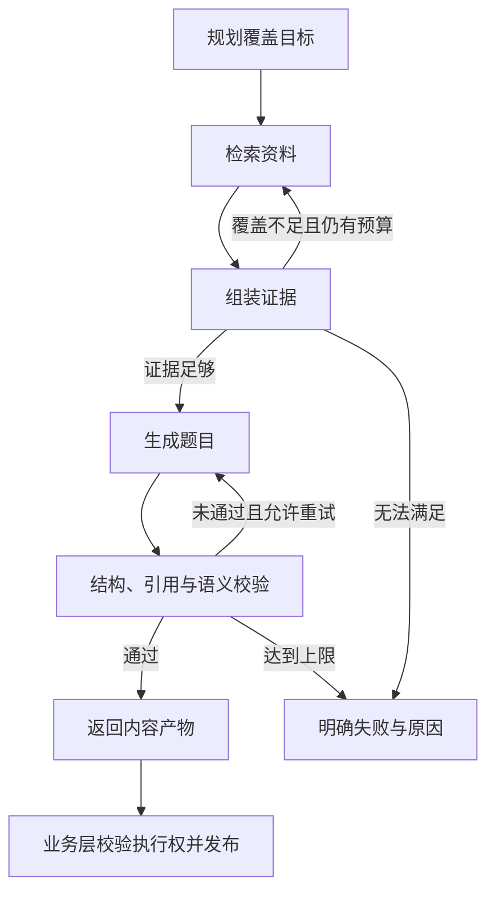

<div align="center">
  
  <h1>循课 AI · Xunke AI</h1>
  <p><strong>把资料组织成课程，让学习有依据、有反馈、有下一步。</strong></p>
  <p>以课程为核心的开源学习 Agent，也是一个可以运行、拆解与扩展的 Agent 应用开发项目。</p>
  <p>
    <a href="#quick-start">快速开始</a> ·
    <a href="#agent-design">Agent 设计</a> ·
    <a href="#architecture">系统架构</a> ·
    <a href="docs/configuration.md">配置指南</a>
  </p>
</div>

<p align="center">
  
  
  
  
  
</p>

## 循课 AI 是什么

循课 AI 面向“手里有资料，却不知道如何系统学习”的个人自学场景。输入一个主题，或上传自己的资料，就能创建课程、逐课学习、围绕内容提问，再通过练习与复习记录继续推进。

对于开发者，循课 AI 提供一套完整的 Web 实践：**LangGraph 如何控制状态与回路，LlamaIndex 如何接入可追溯检索，教学 Skill 如何进入应用，以及长任务、学习记录和模型费用如何可靠衔接。** 适合学习 Agent / RAG 应用开发、课程设计和二次开发，支持电脑与手机浏览器。


## 可以做什么

| 能力 | 使用方式 |
| --- | --- |
| **生成自己的课程** | 按主题或资料创建课程，设置目标、已有基础与每天可用时间；先看纲要，再按需生成课文。 |
| **边学边问** | 对当前课文自由提问，解释某一段、换个例子或获取提示；保存自检回答，再按需请求反馈。 |
| **基于资料查证** | 上传 PDF、DOCX、Markdown、TXT，限定资料或章节多轮问答，点击引用回到原文，还可从有依据的回答发起练习。 |
| **练习与反馈** | 产品覆盖单选、多选、判断、填空、数值、短解释六类题型；课程每课配三道客观题检查，支持继续作答与查看解析。 |
| **持续学习** | 学习空间管理目标、资料与知识点，记录首次检查、补练、错题和复习；“今日学习”结合未完成活动与到期任务推荐下一步。 |
| **比较 RAG 方案** | 在评测工作台冻结数据和配置，比较召回、排序、引用、耗时与费用，按需启用模型 Judge。 |

<a id="design"></a>
<a id="agent-design"></a>

## Agent 设计：编排、工具、上下文与执行边界

循课 AI 将 Agent 应用拆成可单独理解和替换的职责。模型输出先成为内容产物，通过校验后才进入业务系统；工具执行、资料访问和状态更新都有程序约束。

| 关注点 | 当前设计 | 解决的问题 |
| --- | --- | --- |
| **LangGraph · 工作流编排** | 显式 State、Node、条件 Edge，覆盖不足补检索，校验失败有限再生成 | 让执行路径、失败原因与停止条件可追踪 |
| **LangChain · 模型协议** | 使用 ChatAnthropic / ChatOpenAI 适配原生 Claude 与兼容接口，统一调用包装 | 业务逻辑复用同一调用入口，便于更换服务商 |
| **LlamaIndex · 知识检索** | 通过 ChromaVectorStore 适配向量查询，转换成项目自有 Evidence，再与 BM25 / RRF 配合 | 检索框架可替换，证据与权限契约保持一致 |
| **Tool Interfaces · 工具边界** | 显式注入检索、生成、语义校验和重新授权等接口，限定各任务可用能力 | 工具便于替换与隔离验证，模型不能任意写库或结算成绩 |
| **Context & Memory · 上下文与记忆** | 会话持久化，按来源范围与预算选择历史；每轮事实重新检索，课程只加载相关教学规则 | 连续对话保留意图，历史回答不冒充新一轮事实依据 |
| **Structured Output · 结果契约** | Pydantic 校验课程、题目、引用和前置关系，反馈与正式评分分别建模 | 将模型的不确定输出转换为可处理的业务状态 |

### Teach Skill：先规划，再按需生成

### 先规划，再按需生成

一次学习从一份轻量纲要开始。用户进入具体课时后才生成正文，已生成课文保存复用；首次生成课时前可调整标题，开始后固定纲要，保持目标与内容一致。

教学规则作为版本化的 [Teach Skill](.agents/skills/xunke-teach/SKILL.md) 加载，课程、课时和引用使用结构化契约校验。**模型负责提出教学内容，应用负责验证、保存和学习状态更新。** 这让教学策略可以迭代，也把等待与生成开销分散到真正需要的课时。

### LlamaIndex + 混合 RAG：同一份证据贯穿检索与使用

资料课程、知识库问答和资料练习复用证据结构，保留文档版本、章节与原文定位。检索时先限定用户和来源范围，再取候选；引用在生成后核验，展示时继续检查资料授权。

向量与中文 BM25 分别提供语义和关键词召回，RRF 按排名融合，可选重排与父段扩展补充上下文。**检索方案可以替换，内容依据仍然可追溯。** 主题课程明确使用模型知识，资料不足则标明缺口。

LlamaIndex 承担向量查询适配，Chroma 保存索引，项目自己的 Evidence 契约连接来源、上下文和引用。会话历史用于理解追问，当前授权资料提供事实依据，两者分别进入上下文管理。

### LangGraph：每一次回路都有触发条件和终点

资料出题采用 LangGraph 编排。证据覆盖不足时补检索，生成结果未通过校验时有限再生成；轮次、模型调用数、时间和费用共同约束执行。



图中展示严格资料出题链路；预算耗尽、超时或授权失效也会停止执行。**图负责生成内容产物，业务层负责发布与结算。** 课程和问答使用各自明确的业务流程，便于针对不同任务控制行为。

状态包含覆盖计划、候选证据、检索轮次、生成次数和校验结果；条件边读取这些状态决定下一步。当前资料出题最多两轮检索、两次生成，且受共同调用预算约束。持久恢复由外层任务与 attempt 管理，当前未配置 LangGraph Checkpointer 做逐节点续跑。

### 持久任务与预算：长任务可恢复，重复操作有边界

课程、问答和出题进入 MySQL 持久任务队列。worker 用租约与心跳维护执行权，发布前再次校验，避免旧执行结果覆盖新结果；幂等键处理重复提交，成绩结算保留收据。

同一套外呼计量记录模型用量，调用前预占预算、结束后结算。超时且费用未知的调用保留预占，等待对账。**任务状态、业务结果与模型费用各自有据可查。**

<details>
<summary>为什么当前使用 MySQL 任务队列，Redis 在这里适合做什么？</summary>

当前采用 MySQL 的行锁与 `SKIP LOCKED` 领取任务，将任务发布、学习记录和预算状态放在已有的事务体系内协调，减少需要共同维护的基础设施。数据库保存事实，租约与幂等控制有效结果；这项选择优先服务于当前部署规模和一致性需求。

Redis 当前未接入。若后续测量表明缓存、共享限流或任务通知成为瓶颈，可以针对这些职责引入 Redis；成绩与费用仍需可靠持久化，新增消息队列也仍需要处理重投、幂等和执行权。框架和组件的选择由具体问题推动。

</details>

### 教学反馈与学习事实分别记录

自检回答可以直接保存，模型反馈按需请求；正式题目按题型评分，短解释在缺少有效校准时保留暂定状态。首次成绩、补练和复习记录分别保存，补练完成后仍能看到原来的错误。

“今日学习”根据未完成练习、到期复习和课程进度计算建议，查看建议无需调用模型。**该用规则判断的地方使用规则，模型集中处理讲解与生成。**

### 用同一把尺子比较改动

评测冻结资料、标注和运行配置，再比较检索或生成方案。确定性检查、可选模型 Judge 和人工复核各有职责；耗时与费用和质量一起记录，帮助判断一次优化是否值得保留。

独立评分进程通过受控 API 获取任务与提交结果，部署时不持有业务数据库凭据或原始资料卷。基础评测可直接运行，外部 Judge 按需启用。

<a id="architecture"></a>

## 系统架构


| 层次 | 技术与职责 |
| --- | --- |
| 交互 | React 19、TypeScript、Vite、TanStack Query：课程、问答、练习与任务状态 |
| 业务 | FastAPI、Pydantic、MySQL：身份、权限、数据契约、学习记录、任务与预算 |
| Agent 与模型 | LangGraph StateGraph、显式工具接口、版本化 Teach Skill；LangChain 适配模型协议 |
| 检索与上下文 | LlamaIndex、Chroma、中文 BM25 / RRF、可选重排、证据契约与上下文预算 |
| 运行与评测 | RAG owner 集中管理本地索引，独立评测 worker 评分，Docker Compose / Nginx 部署 |

LLM、Embedding 与可选重排服务分别配置。Claude 使用原生 Anthropic 协议，也支持 DeepSeek 和 OpenAI 兼容服务。Chroma 随 RAG owner 使用本地持久化目录，基础部署无需额外的 Redis 或本地 GPU。

<a id="quick-start"></a>

## 快速开始

准备 **Docker Desktop / Docker Engine、Docker Compose 2.24.4+ 和 Python 3.11**，下载源码后在项目根目录执行。

**1. 生成私有配置**

```shell
python deploy/init_env.py
```

脚本创建 `deploy/.env` 并生成独立随机密钥。已有该文件时直接编辑，保留现有数据库与应用密钥。

**2. 配置模型与注册邮箱**

编辑 `deploy/.env`，先完成下面三类配置：

| 服务 | 作用 | 配置入口 |
| --- | --- | --- |
| **LLM** | 课程、答疑、练习与讲解 | 选择 `LLM_PROVIDER`，填写对应 API 地址、密钥和模型名 |
| **Embedding** | 资料向量化与检索；主题课程无需此项 | `DASHSCOPE_API_KEY`、模型、地址与匹配的向量维度 |
| **SMTP** | 新账号邮箱验证码注册 | QQ / 163 SMTP 地址、发件邮箱与客户端授权码 |

完整示例见 [模型与服务配置指南](docs/configuration.md)，所有参数见 [环境变量模板](deploy/env.example)。课程与综合练习在模板中已启用；未配置模型时可以浏览首页和预置题目，已有账号仍可登录，新注册需要 SMTP。

**3. 构建、迁移并启动**

```shell
docker compose --env-file deploy/.env -f deploy/compose.yaml -f deploy/compose.local.yaml build
docker compose --env-file deploy/.env -f deploy/compose.yaml -f deploy/compose.local.yaml up -d --wait mysql
docker compose --env-file deploy/.env -f deploy/compose.yaml -f deploy/compose.local.yaml run --rm migrate
docker compose --env-file deploy/.env -f deploy/compose.yaml -f deploy/compose.local.yaml up -d api rag-owner eval-scorer web
```

打开 **[http://localhost:18080](http://localhost:18080)**，通过邮箱注册并保存恢复码，即可创建课程。

## 第一次怎样使用

1. 进入「我的课程」，输入主题、目标和已有基础，设置每天学习时间与课时数。也可以先上传资料，处理完成后选择资料或章节。
2. 查看生成的纲要，按需调整标题，再进入第一课生成课文。
3. 学习时使用段落解释和课内助教，保存自检回答，需要反馈时点击「检查我的理解」。
4. 完成三题检查，查看解析与错题；在课时中继续补练，或在「今日学习」继续到期复习与下一课。

| 来源模式 | 内容依据 |
| --- | --- |
| **主题课程** | 基于当前 LLM 的通用知识，标明未经外部资料核验。 |
| **资料课程** | 使用选定资料的冻结版本，保留引用，材料不足的课时标明缺口。 |

资料课程与主题课程均不自动联网。当前单份文件上限为 10 MB；PDF 需含可提取文字，扫描件请先进行 OCR。

<details>
<summary>学习记录、评分与复习如何理解</summary>

- 阅读完成由用户标记；生成课文、已读、已完成检查分别记录。
- 课堂自检的保存与反馈不计正式成绩、经验值或掌握状态。
- 课程检查使用单选、多选、判断三类客观题；填空、数值、短解释使用独立的练习与评分流程。
- 短解释的模型评分在缺少有效校准时为暂定分，授权复核与自评独立保存。
- 首次成绩与后续补练、复习分别记录。课程当前提供次日复习建议，支持明确选择提前复习。
- 生成任务通过状态轮询展示进度，当前采用确定性复习规则。

</details>

## 使用评测工作台

流程为 **准备资料 → 创建并标注数据集 → 冻结版本 → 运行方案 → 比较结果**。

工作台需要 `evaluator` 角色。管理员按 [评测配置说明](docs/configuration.md#evaluation) 授权后，可从导航进入。基础评分无需外部 Judge；需要模型判断维度时，再配置独立的 Judge 服务。各类样本使用各自适用的指标，效果结论应结合实际标注与运行结果。

## 常见问题

**生成失败或长时间等待？**

检查所选模型是否可用、额度与预算是否充足；单次调用超时和整个任务截止时间分别配置。任务失败后可在页面重试，具体参数见 [配置指南](docs/configuration.md#timeouts)。

**配置修改后没有生效？**

更新 `deploy/.env` 后需要重新创建相关容器。仅执行 `restart` 不会重新加载环境变量。

**资料上传后无法使用？**

检查可提取文字、Embedding 服务和向量维度。更换向量模型后需要重建对应资料索引。

**如何部署到服务器？**

使用 HTTPS 域名、证书与生产 Compose 配置，详见 [部署说明](docs/configuration.md#deployment)。

## 参与贡献与许可

欢迎通过 Issue 反馈问题、讨论使用场景，或提交 Pull Request 改进教学体验、检索策略与工程实现。反馈时附上复现步骤、环境版本和脱敏后的错误信息。

项目采用 [MIT License](LICENSE)。教学 Skill 参考 Matt Pocock 的 `teach`，并增加资料来源策略、结构化课程契约和学习状态边界，来源与许可见 [第三方说明](.agents/skills/xunke-teach/THIRD_PARTY_NOTICES.md)。
